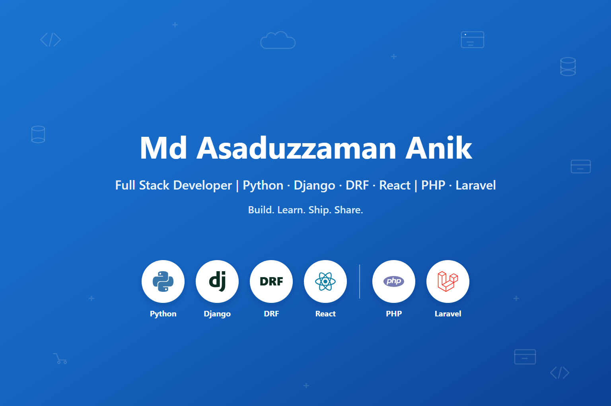

  

  <h1>Hi 👋, I'm Md Asaduzzaman Anik</h1>

  <h3>Full Stack Developer | Python · Django · DRF · React | PHP · Laravel</h3>

  <i>Building business applications, REST APIs, dashboards, CRM/POS systems, and full-stack web applications.</i>

    

  
  
  
  
  
  

   

  
  
  
  
  

   

  📍 Dhaka, Bangladesh · Open to remote opportunities

---

## About Me

I am a **Full Stack Developer** with professional production experience in **Laravel / PHP**, and hands-on experience building full-stack applications with **Python**, **Django**, **Django REST Framework (DRF)**, and **React**.

In production I have built CRM, POS, and eCommerce systems, plus reusable Laravel modules — relational databases, scheduled jobs, REST APIs, and React interfaces shaped with clients. Alongside that work, my Django projects cover multi-warehouse inventory and hospital operations: Django ORM, JWT authentication, role-based access, Celery, Redis, and React frontends that consume those APIs.

I have a **B.Sc. in Computer Science (Data Science)** and university teaching experience in web development and software engineering, including Python and JavaScript.

| | |
|---|---|
| 🎓 **120+** students mentored in full-stack development | 🧑‍🏫 **15+** capstone projects supervised |
| 💼 Professional Laravel/PHP engineering since 2025 | 🏛️ **B.Sc. Computer Science** — Multimedia University, Malaysia |

---

## Tech Stack

### Backend
Python · Django · Django REST Framework · PHP · Laravel · REST APIs · Celery · Redis

### Frontend
React · TypeScript · JavaScript · Vite · Next.js · Tailwind CSS · HTML5 · CSS3

### Database
MySQL · PostgreSQL · Django ORM · Eloquent ORM · Relational database design

### Authentication & API
JWT · SimpleJWT · RBAC · Custom DRF permissions · CORS · OpenAPI / Swagger

### Testing & DevOps
pytest · Vitest · Docker · Git

---

## 🐍 Django & Python Projects

### Inventory Management System · [GitHub](https://github.com/asaduzzaman-anik/django-inventory-management)

Hands-on portfolio project for multi-warehouse inventory: purchase orders, sales workflows, stock reservations, and an immutable inventory ledger.

- Django REST Framework and Django ORM, with `transaction.atomic` and `select_for_update` for concurrency-safe stock updates
- SimpleJWT, role-based permissions, and warehouse-level access control
- Celery and Redis for stock alerts, plus CSV and Excel reporting
- React, TypeScript, Vite, and Tailwind admin UI, with pytest and Vitest
- Docker Compose for the API, MySQL, and Redis

### Hospital Management System

Hands-on full-stack project for hospital operations, split across an API and a React client.

- [API repository](https://github.com/asaduzzaman-anik/Hospital-Management-API) — Django REST Framework, SimpleJWT, and custom DRF permissions for Admin, Doctor, Patient, and Receptionist
- Appointment lifecycle (pending, approved, completed, cancelled), plus prescriptions, medicines, and billing
- Filtering, search, and pagination on list endpoints
- [Frontend repository](https://github.com/asaduzzaman-anik/hospital-management-frontend-react) — React, Vite, Tailwind, protected routes, and Axios against the API

---

## 🐘 Laravel & PHP Projects

### Eclipse Auto Parts — CRM / POS / eCommerce · [eclipseautoparts.com](https://eclipseautoparts.com/)

Professional production system for an auto parts business, built in my role at SquartUp.

- CRM, POS, and eCommerce on Laravel, PHP, and MySQL
- Account 360, customer health monitoring, and churn-risk analysis
- Scheduled analysis pipelines with Laravel Scheduler
- React, Alpine.js, and Tailwind on the interface

### Laradashboard · [Live](https://laradashboard.com/) · [GitHub](https://github.com/laradashboard/laradashboard)

Professional work on a modular Laravel dashboard platform.

- Reusable Laravel / PHP modules, REST APIs, and MySQL
- Dashboard architecture with React UI components

---

## Professional Experience

### Full Stack Developer — SquartUp
**January 2025 – Present**

Production engineering role. The primary stack here is **Laravel / PHP**.

- Build and maintain a production CRM, POS, and eCommerce system at [eclipseautoparts.com](https://eclipseautoparts.com/)
- Relational database work in MySQL, with scheduled background processing via Laravel Scheduler
- Reusable Laravel modules for [Laradashboard](https://laradashboard.com/) — backend logic, REST APIs, and React UI
- Collaborate with clients to turn business requirements into maintainable implementations

`Laravel` `PHP` `MySQL` `Eloquent` `React` `Alpine.js` `Tailwind` `REST API`

---

### Lecturer (Computer Science) — Royal University of Dhaka
**May 2022 – April 2025**

- Taught Web Development, Software Engineering, and Programming Fundamentals (Python, JavaScript, and related coursework)
- Mentored **120+** students in full-stack practice and Git
- Supervised **15+** capstone projects and evaluated **500+** assessments

`Python` `JavaScript` `SQL` `HTML` `CSS`

---

### Data Analyst Intern — HappyFresh Malaysia
**March 2019 – June 2019**

Dashboards and stakeholder reports with Tableau and Redash, including PostgreSQL, Python, and ETL.

---

## Education

**Bachelor of Computer Science (Data Science)**  
Multimedia University (MMU) — Cyberjaya Campus, Malaysia

---

## What I Bring

- End-to-end full-stack delivery, from data model and API to a React interface
- Django and Django REST Framework: JWT, RBAC, custom permissions, and ORM-level business rules
- Professional Laravel / PHP experience on live CRM, POS, and eCommerce systems
- React frontends in both ecosystems, including TypeScript and Vite
- Relational database design with MySQL, Django ORM, and Eloquent
- REST API design, authentication, and role-based access control
- Background processing with Celery and Redis, and scheduled jobs in Laravel
- Testing with pytest and Vitest, and Docker for local services
- Client communication, and teaching experience that shows up as clearer documentation

---

## GitHub Stats

---

## Let's Work Together

I'm open to **full-time**, **contract**, and **freelance** opportunities — remote or hybrid — for Django/Python and Laravel/PHP full-stack roles.

| | |
|---|---|
| 🌐 **Portfolio** | [asaduzzaman-anik.github.io](https://asaduzzaman-anik.github.io/) |
| 💼 **LinkedIn** | [linkedin.com/in/anik-asaduzzaman](https://www.linkedin.com/in/anik-asaduzzaman/) |
| 🐙 **GitHub** | [github.com/asaduzzaman-anik](https://github.com/asaduzzaman-anik) |
| ✉️ **Email** | [asaduzzamananik12@gmail.com](mailto:anik.builds@gmail.com) |

---

⭐ If you find my work interesting, feel free to star a repository or reach out — I'd love to connect.

